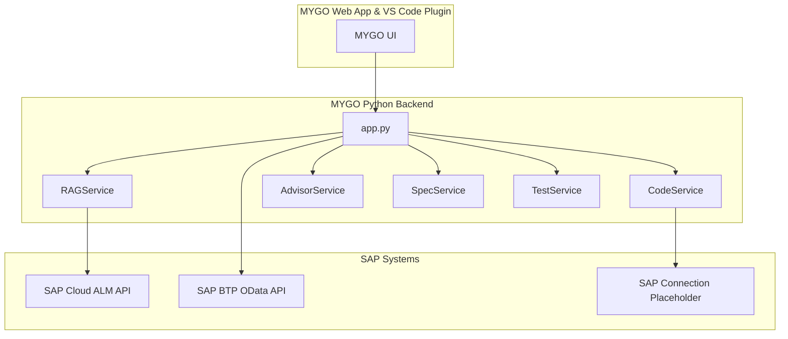
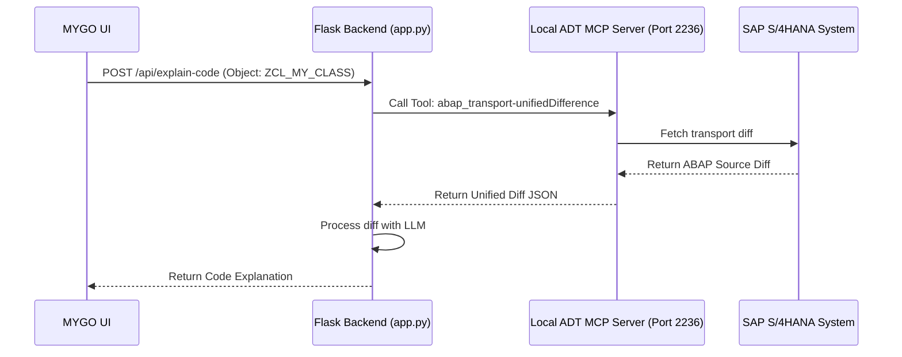

# Integration Analysis: SAP ADT MCP Server for Yoda & MYGO AI Ecosystem

This report analyzes how the newly released **SAP ADT (ABAP Development Tools) MCP Server** can be integrated into the MYGO AI Ecosystem to power **Yoda** (RAG Q&A) and other assistant tools with real-time, interactive SAP system capabilities.

---

## 1. What is the SAP ADT MCP Server?

SAP's ADT MCP Server is a local HTTP/SSE-based server implementing the open **Model Context Protocol (MCP)** standard. Enabled directly inside VS Code through the ABAP Development Tools extension, it starts a local server (default port `2236`) at `http://localhost:<port>/mcp`. It exposes a suite of capabilities that allow AI hosts to interact directly and securely with the active SAP system.

### Key Tools Provided by SAP ADT MCP

| Toolset | Specific MCP Tools | Purpose |
| :--- | :--- | :--- |
| **System Destinations** | `abap_lists_destinations` | Lists all configured ABAP target destinations/systems. |
| **Object Creation** | `abap_creation-get_all_creatable_objects`<br>`abap_creation-get_object_type_details`<br>`abap_creation-run_validation`<br>`abap_creation-create_object` | Handles naming validation and creates ABAP object skeletons. |
| **Activation** | `abap_activate_objects` | Triggers activation of modified or newly created ABAP objects. |
| **Transports** | `abap_transport-create`<br>`abap_transport-get`<br>`abap_transport-unifiedDifference` | Manages transport requests and retrieves unified diffs of object changes. |
| **Unit Tests** | `abap_run_unit_tests` | Executes unit tests and reads results (passes, failures, assertions). |
| **RAP Generators** | `abap_generators-list_generators`<br>`abap_generators-get_schema`<br>`abap_generators-generate_objects` | Generates complete RAP packages (tables, CDS views, service bindings). |
| **Business Services** | `abap_business_services-fetch_services`<br>`abap_business_services-fetch_service_information` | Queries OData services and entity structures from service bindings. |
| **Test Cockpit (ATC)** | `abap_run_atc`<br>`abap_atc_get_result`<br>`abap_atc_execute_deterministic_quickfixes` | Executes ABAP Test Cockpit checks and applies quick-fixes. |

---

## 2. Current MYGO Architecture vs. SAP ADT MCP

Currently, the MYGO backend has a static LLM-driven architecture with some placeholder integrations. 



By introducing an integration with the **SAP ADT MCP Server**, we can bridge the gap between static analysis/RAG and real-time execution.

---

## 3. How ADT MCP Benefits Yoda & Other MYGO Tools

Integrating these tools changes the scope of MYGO's capabilities:

### A. Yoda (RAG Q&A)
*   **From Static to Live Context**: Currently, [RAGService](file:///c:/Users/HP/Downloads/mygo-ai-ecosystem/web-app/backend/services/rag_service.py) queries static uploaded documents, specs, and Jira tickets. With ADT MCP, if a developer asks Yoda: *"What OData services are exposed for the Travel binding?"*, Yoda can call `abap_business_services-fetch_services` to provide a real-time response.
*   **System Diagnostics**: Yoda can list destinations (`abap_lists_destinations`) and active configurations to help developers understand their workspace context dynamically.

### B. Code Explainer & Advisor (Real-Time Code Fetching)
*   **Eliminating Placeholders**: [CodeService.fetch_code_from_sap](file:///c:/Users/HP/Downloads/mygo-ai-ecosystem/web-app/backend/services/code_service.py#L45-L51) is currently a placeholder. By querying the local workspace files or utilizing transport diffs (`abap_transport-unifiedDifference`), the system can fetch actual code from the active system.
*   **Official SAP ATC Rules**: Rather than guessing anti-patterns solely via GPT heurism in [AdvisorService](file:///c:/Users/HP/Downloads/mygo-ai-ecosystem/web-app/backend/services/advisor_service.py), the advisor can run `abap_run_atc`, retrieve official compiler findings (`abap_atc_get_result`), explain them, and execute automated quick-fixes (`abap_atc_execute_deterministic_quickfixes`).

### C. Test Case Generator (Auto-Healing Test Loop)
*   **Write, Activate, Test, Heal**: [TestService](file:///c:/Users/HP/Downloads/mygo-ai-ecosystem/web-app/backend/services/test_service.py) currently creates unit skeletons. With ADT MCP, MYGO can execute a complete agentic loop:
    1. Write unit tests.
    2. Activate them using `abap_activate_objects`.
    3. Run them via `abap_run_unit_tests`.
    4. If any test fails, Yoda analyzes the traceback and automatically modifies the code/tests until they pass.

### D. Spec Assistant (Specs-to-Code Generation)
*   **Direct Object Deployment**: After [SpecService](file:///c:/Users/HP/Downloads/mygo-ai-ecosystem/web-app/backend/services/spec_service.py) generates technical specifications, MYGO can invoke RAP Generators (`abap_generators-generate_objects`) to instantiate the required database tables, CDS views, and service definitions directly.

---

## 4. Integration Architecture Options

Since MYGO has both a React/Next.js frontend and a Python Flask backend, there are two primary integration paths:

### Option A: VS Code Client-Side Routing (Recommended)
Since the ADT MCP server runs locally on the developer's laptop (`localhost:2236`), the VS Code extension for MYGO can configure the ADT MCP server inside the IDE (e.g. Copilot or Amazon Q). Alternatively, if the user interacts through the MYGO Web App, the web application (running in the browser) can securely send requests to the local ADT MCP endpoint.

### Option B: Flask Backend as an MCP Client
The Flask backend acts as a client to the local MCP server when requests are routed through it.



---

## 5. Implementation Draft: MCP Client in Python Backend

Here is how the Flask backend can connect to the local ADT MCP server. We can add an `MCPClientService` that retrieves the port and bearer token from the developer's configuration:

```python
import os
import requests
from typing import Dict, Any

class ADTMCPClient:
    def __init__(self, port: int = 2236, token: str = None):
        self.base_url = f"http://localhost:{port}/mcp"
        self.headers = {
            "Content-Type": "application/json",
            "Authorization": f"Bearer {token}" if token else ""
        }

    def call_tool(self, tool_name: str, arguments: dict) -> Dict[str, Any]:
        """Invoke a tool on the local ADT MCP Server."""
        payload = {
            "jsonrpc": "2.0",
            "method": "tools/call",
            "params": {
                "name": tool_name,
                "arguments": arguments
            },
            "id": 1
        }
        try:
            response = requests.post(f"{self.base_url}", json=payload, headers=self.headers, timeout=30)
            response.raise_for_status()
            result_json = response.json()
            if "error" in result_json:
                raise Exception(f"MCP Tool Error: {result_json['error']}")
            return result_json.get("result", {})
        except Exception as e:
            return {"error": str(e), "content": [{"type": "text", "text": f"Failed to call tool: {str(e)}"}]}
```

---

## 6. Recommended Agent Configuration (`agents.md`)

To align Yoda's behavior when executing these tools, we can define project-level rules in our customizations (`agents.md`):

```markdown
# Yoda SAP Development Guidelines
- Always list target systems using `abap_lists_destinations` before object creation.
- Check naming guidelines and validation schemas using `abap_creation-run_validation`.
- Execute a safety check using `abap_run_atc` before committing changes to a transport request.
- Run unit tests (`abap_run_unit_tests`) iteratively until they pass before concluding development tasks.
```
